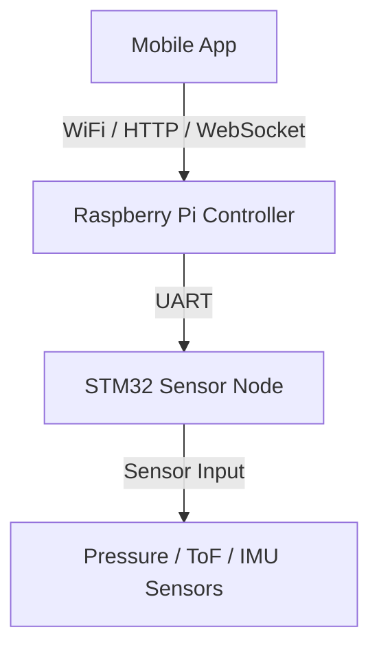
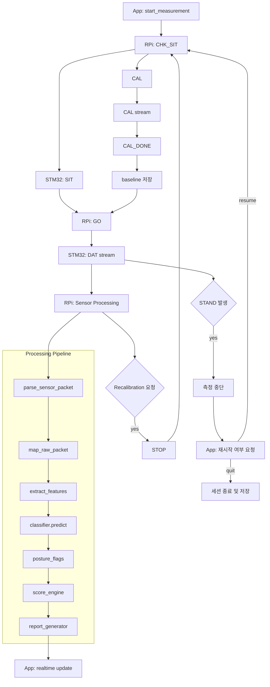
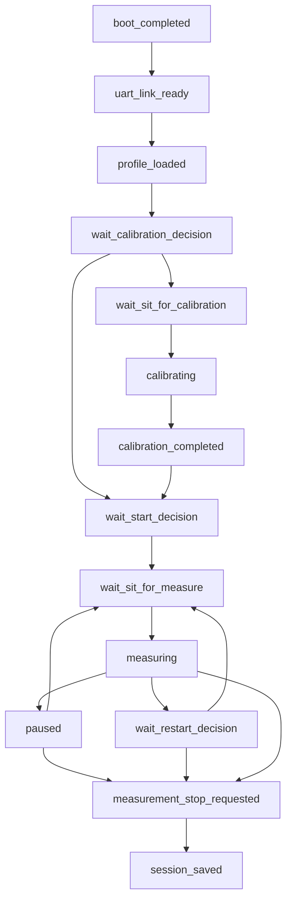
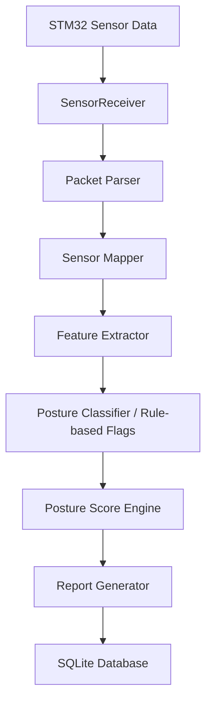

# Edge AI Posture Monitoring System

STM32 센서 노드와 Raspberry Pi 엣지 런타임을 분리한 구조에서
UART 기반 실시간 스트리밍 -> 자세 분류 -> 리포트 생성까지 수행하는 
End-to-End 자세 분석 시스템

센서 데이터를 기반으로 사용자의 앉은 자세를 실시간으로 분석하고,
자세 점수 및 분/일 단위 자세 리포트를 생성하는 Edge AI 기반 자세 모니터링 시스템이다.

STM32가 로드셀, ToF, IMU 센서 데이터를 수집하고,
Raspberry Pi가 UART binary stream을 수신하여 자세 feature 추출, 자세 판별,
세션 상태 관리, 리포트 생성, 데이터 저장을 수행한다.

본 프로젝트는 단순 센서 수집 수준이 아니라,
STM32 기반 센서 노드와 Raspberry Pi 기반 엣지 런타임을 분리하여
실시간 수신, feature 추출, 자세 판별, 상태 관리, 리포트 저장까지 포함하는
임베디드-엣지 통합 시스템으로 설계되었다.

---


---

## 프로젝트 특징

- **UART Binary Streaming Pipeline**
  - STM32 → Raspberry Pi 간 실시간 센서 데이터 스트리밍 및 checksum 검증

- **Sensor Fusion 기반 Feature Extraction**
  - Loadcell / ToF / IMU 데이터를 결합한 자세 feature 구성

- **Rule-based Posture Classification**
  - 다중 센서 기반 자세 판별 로직 및 posture flag 설계

- **Session State Machine**
  - pause / resume / recalibration / quit 흐름을 포함한 상태 관리

- **Event-driven Runtime**
  - STAND 이벤트 기반 측정 종료 및 재시작 분기 처리

- **Hierarchical Reporting System**
  - 실시간 / 분 단위 / 일 단위 자세 리포트 생성

- **Hardware-independent Testing**
  - Fake STM32 기반 end-to-end 테스트 환경 구축

- **Data Logging for Future Learning**
  - Sample logging을 통한 향후 ML/LLM 학습 데이터셋 확보

---

# 1. 프로젝트 개요

Edge Posture Monitor는 장시간 앉아서 작업하는 환경에서
사용자의 자세를 분석하고 잘못된 자세를 감지하기 위해 설계된 시스템이다.

이 시스템은 센서 데이터를 기반으로 사용자의 자세를 분류하고
자세 점수를 계산하여 리포트를 생성한다.

주요 기능

- 실시간 자세 감지
- 자세 점수 계산
- 자세 패턴 분석
- 분 단위 자세 리포트 생성
- 하루 단위 자세 리포트 생성

---

# 2. 시스템 구조

전체 시스템은 다음과 같은 구조로 구성된다.

STM32는 센서 수집 전용 노드로 동작하고,
Raspberry Pi는 모든 연산(파싱, feature 추출, 분류, 리포트)을 담당하는 Edge Runtime으로 구성된다.



## 센서 구성

- Loadcell 12채널
    - 등판 8채널
    - 좌판 4채널
- 1D ToF 4채널
    - 등판(spine) 거리 측정
- 3D ToF 2개 센서
    - 좌/우 head 영역 거리 정보 총 32개 값 사용
- MPU6050 2개
    - 좌/우 pitch angle을 평균하여 자세 판단에 활용

## 시스템 동작 흐름 (Runtime Overview)



---

# 3. Mock Validation 결과

본 자세 분석 시스템은 Fake STM32 기반 시나리오 테스트를 통해 파이프라인의 정상 동작과 자세 분류 안정성을 검증하였다.

## 검증 완료 자세
다음 자세들은 단일 시나리오에서 기대한 dominant posture로 안정적으로 분류되었다.

- 거북목 (turtle_neck)
- 전방 기울기 (forward_lean)
- 뒤로 기대는 자세 (reclined)
- 측면 쏠림 (side_slouch)
- 다리 꼬기 (leg_cross_suspect)
- 걸터앉기 (perching)

각 시나리오는 posture duration 분포와 session summary에서 일관된 dominant posture를 생성하였다.

## thinking_pose 한계
`thinking_pose`는 특성상 normal 자세와 일부 중첩되는 경향이 확인되었다.  
(약한 전방 기울기 + 목 관여)

- 기존 문제였던 forward_lean / turtle_neck으로의 오분류는 해결됨
- 일부 구간에서 normal과 혼합되어 분류됨

해당 특성은 mock 환경에서는 자연스러운 결과로 판단되며, 실제 센서 데이터 기반으로 추가 보정할 예정이다.

## 검증 범위
다음 시스템 구성 요소들이 정상 동작함을 확인하였다.

- UART 통신 파이프라인 (Fake STM32 → 서버)
- 실시간 자세 분류 로직
- 세션 단위 집계 로직
- 분 단위 요약 (Minute Summary)
- Enhanced Report 생성 (요약 / 추이 / 운동 추천)
- SQLite 기반 데이터 저장

## 다음 단계
실제 STM32 센서 데이터를 연동한 이후, posture threshold 및 thinking_pose 분류 기준을 재보정할 예정이다.

> 본 검증은 실제 하드웨어 없이도 전체 파이프라인을 사전 검증하기 위한 시뮬레이션 기반 테스트로 수행되었다.

---

# 4. Runtime 상태 흐름 (State Machine)

시스템은 다음과 같은 상태 흐름으로 동작한다.


---

# 5. 데이터 처리 파이프라인

센서 데이터는 다음과 같은 파이프라인을 통해 처리된다.
`(Parsing -> Mapping -> Feature Extraction -> Classification -> Scoring -> Reporting)`


---

# 6. 주요 기능

## 실시간 자세 감지

센서 데이터를 기반으로 사용자의 자세를 실시간으로 분류한다.

지원되는 자세 유형

- normal
- turtle_neck
- forward_lean
- reclined
- side_slouch
- leg_cross_suspect
- thinking_pose
- perching

---

## 캘리브레이션 / 재캘리브레이션

시스템은 사용자별 baseline 자세 데이터를 저장하고,
필요 시 재캘리브레이션을 수행할 수 있다.

재캘리브레이션 흐름

1. 측정 중단(STOP)
2. 착석 확인(CHK_SIT / SIT)
3. 캘리브레이션 시작(CAL)
4. CAL stream 수신 및 baseline 계산
5. CAL_DONE 확인
6. baseline 저장
7. 이후 측정 재시작 여부 선택

사용자는 기존 프로필 선택 후에도 재캘리브레이션을 수행할 수 있다.

---

## 자세 점수 계산

각 자세 상태를 기반으로 자세 점수를 계산한다.

평가 요소

- 목 각도
- 허리 기울기
- 상체 중심

---

## STAND 감지

사용자가 자리에서 일어나는 경우를 감지한다.

STAND 감지 시

- STM32가 STAND를 감지하면 측정은 중단되고 idle 상태로 전환된다.
- 앱은 사용자에게 재측정 여부를 묻는다.
- 사용자가 재개를 선택하면 착석 확인 후 측정을 이어서 진행한다.
- 사용자가 종료를 선택하면 현재까지 누적된 데이터를 저장하고 세션을 종료한다.

---

## 자세 리포트 생성

시스템은 다음 3단계의 리포트를 생성한다.

1. 실시간 자세 상태
2. 분 단위 자세 리포트
3. 하루 단위 자세 리포트

예시 데이터

- avg_score
- total_sitting_sec
- dominant_posture
- good_posture_ratio
- bad_posture_ratio

---

# 7. 동작 결과

## 동작 예시
- UART handshake 완료
- 캘리브레이션 10초 baseline 수집
- 측정 시작 후 실시간 자세 상태 전송
- STAND 이벤트 감지 시 재시작 / 종료 분기
- 측정 종료 후 session / minute / daily report 저장

## 센서 데이터 수신

UART를 통해 STM32에서 센서 데이터를 수신한다.

## 자세 분석 결과

실시간 자세 분류 결과가 생성된다.

## 리포트 생성

측정 종료 후 다음과 같은 리포트가 생성된다.

- 평균 자세 점수
- 총 착석 시간
- 주요 자세 유형
- 자세 비율 분석

## 실제 검증 결과

- 단일 posture 시나리오에서 expected dominant posture 100% 근접 검출
- session / minute report 정상 생성 및 DB 저장 검증 완료
- STAND 이벤트 기반 종료/재시작 흐름 정상 동작

---

# 8. 기술 스택

### Hardware
- STM32 (Sensor Node)
- Raspberry Pi (Edge Runtime)

### Backend / Runtime
- Python (Async + Thread 기반 처리)
- UART Serial Communication
- WebSocket / HTTP API

### Data Processing
- Sensor Fusion (Loadcell + ToF + IMU)
- Rule-based Classification Engine
- Real-time Stream Processing

### Storage
- SQLite (Session / Report 저장)

### Testing
- Fake STM32 Simulator
- Mock-based End-to-End Validation

---

# 9. 실행 방법

Mock 테스트 환경에서는 가상 시리얼 포트 페어를 먼저 생성한 뒤,
한쪽은 fake_stm32, 다른 한쪽은 main_real.py에 연결해야 한다.

## 1. 저장소 클론

```bash
git clone https://github.com/gwonxhj/edge-posture-monitor.git
cd edge-posture-monitor
```

## 2. 의존성 설치

```bash
pip install -r requirements.txt
```

## 3. Mock STM32 실행

```bash
python -m tools.fake_stm32 --port /tmp/posture_stm32 --baud 115200
```

## 4. Raspberry Pi 서버 실행

```bash
POSTURE_UART_PORT=/tmp/posture_rpi \
POSTURE_UART_MOCK=1 \
POSTURE_UART_BAUD=115200 \
python main_real.py
```

## 5. API 테스트

```bash
curl http://127.0.0.1:8000/health
```

---

# 10. API 인터페이스

Raspberry Pi는 모바일 앱과 통신하기 위한 HTTP API를 제공한다.

주요 엔드포인트

- `GET  /health`
- `GET  /meta`
- `POST /command`
- `WS   /ws`

세부 명세는 아래 문서에 정리되어 있다.
- `docs/api_spec.md`


# 11. 데이터베이스 구조

시스템은 SQLite 데이터베이스를 사용한다.

사용되는 테이블

- users
- baselines
- sessions
- minute_reports
- daily_reports

각 테이블의 역할

- users  
 : 사용자 프로필 정보 저장

- baselines  
 : 사용자 자세 기준값 저장

- sessions  
 : 측정 세션 기록

- minute_reports  
 : 분 단위 자세 분석 결과

- daily_reports  
 : 하루 단위 자세 분석 결과

---

# 12. Mock 테스트 환경

실제 STM32 하드웨어 없이 테스트할 수 있도록
Fake STM32 환경이 제공된다.

사용 파일
```text
tools/fake_stm32.py
```

이를 통해 다음 기능을 테스트할 수 있다.
- UART 통신
- 자세 분석 로직
- 리포트 생성
- 데이터베이스 저장
- pause / resume / quit 제어 흐름
- STAND 이후 재측정 / 종료 흐름

---

# 13. 문서

프로젝트 관련 상세 문서는 docs 폴더에 정리되어 있다.
- docs/system_architecture.md
- docs/api_spec.md
- docs/test_checklist.md

---

# 14. 향후 개발 계획

- 실제 STM32 센서 하드웨어 연동 및 실측 데이터 검증
- 실측 데이터 기반 자세 분류 모델 재학습
- 3D ToF spatial summary 고도화
- 사용자 피드백(진동/음성/앱 알림) 연동
- 장기 자세 패턴 분석 및 개인화 리포트 기능 확장
- enhanced_report는 현재 rule-based 방식으로 생성되며, 향후 동일한 출력 schema를 유지한 채 LLM 기반 개인화 리포트 엔진으로 확장할 예정이다.

현재는 Mock/시스템 통합 검증과 실시간 파이프라인 구현을 우선 완료했으며,
실측 센서 데이터 기반 모델 재학습은 후속 단계로 진행할 예정이다.

---

# 15. 개발자

권혁준

AI / Embedded Systems

---

# 16. 프로젝트 구조
```text
edge-posture-monitor
│
├ docs                    # 시스템 구조, API, 테스트 문서
│   ├ api_spec.md
│   ├ system_architecture.md
│   └ test_checklist.md
│
├ src
│   ├ communication       # UART / WebSocket / API 통신 처리
│   ├ sensor              # 센서 데이터 수집 및 mock 시뮬레이터
│   ├ core                # feature 추출, posture classification 로직
│   ├ runtime             # 상태 머신 및 측정 세션 관리
│   ├ report              # 리포트 생성 (summary / trend / recommendation)
│   └ storage             # SQLite DB 처리 및 데이터 저장
│
├ tools
│   └ fake_stm32.py       # STM32 시뮬레이터 (mock 테스트)
│
├ data                    # 로그 및 수집 데이터
├ models                  # 향후 ML 모델 저장 영역
├ profiles                # 사용자 baseline 데이터
│
├ main_real.py            # 시스템 실행 entry point
├ requirements.txt
└ README.md
```