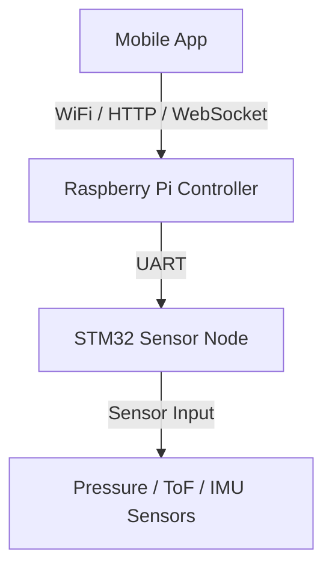
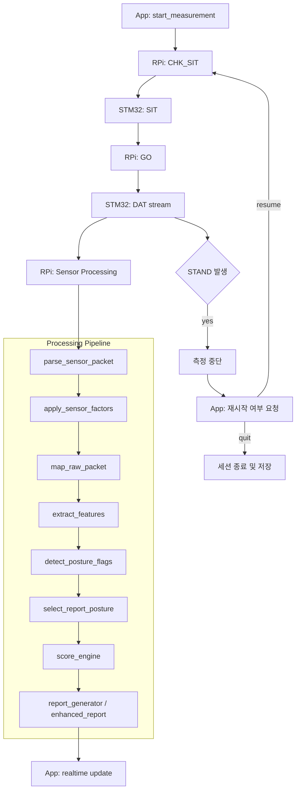
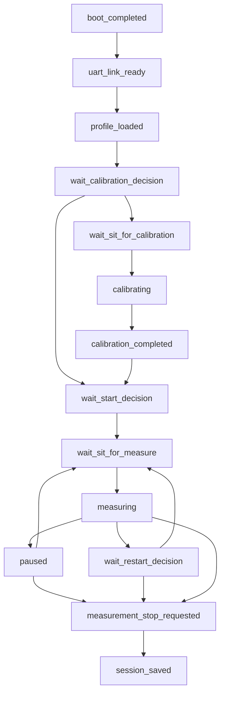
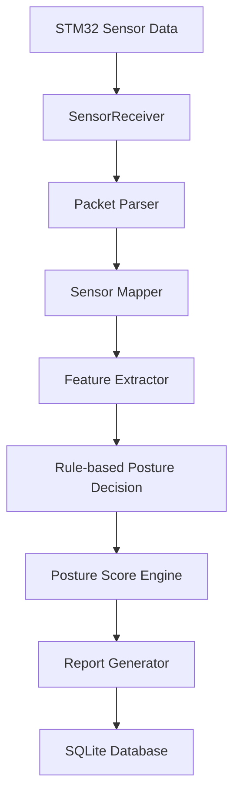

# Edge AI Posture Monitoring System

STM32 센서 노드와 Raspberry Pi 엣지 런타임을 분리한 구조에서
UART 기반 실시간 센서 스트리밍 -> 자세 특징 추출 -> 규칙 기반 자세 판별 -> 세션 리포트 생성까지 수행하는 End-to-End 자세 분석 시스템입니다.

이 프로젝트는 Loadcell, ToF, IMU 센서 데이터를 기반으로 사용자의 앉은 자세를 분석하고,
자세 점수, 자세 분포, 분 단위 요약, 세션 종료 후 Enhanced Report를 생성하는 Edge AI 기반 자세 모니터링 시스템입니다.

STM32는 센서 데이터 수집 및 전송을 담당하고,
Raspberry Pi는 UART 바이너리 패킷 수신, 센서 보정, feature 추출, 규칙 기반 자세 판별, 상태 관리, 리포트 생성, SQLite 저장을 담당합니다.

본 프로젝트는 단순 센서 수집 수준이 아니라,
STM32 기반 센서 노드와 Raspberry Pi 기반 엣지 런타임을 분리하여
실시간 수신, 캘리브레이션 기준 자세 생성, 센서 보정, 자세 분석, 세션 리포트 저장, 앱 실시간 전송까지 포함하는 임베디드-엣지 통합 시스템으로 설계되었습니다.

---


---

## Overview

이 프로젝트는 카메라 없이 Loadcell, ToF, 기울기 센서를 이용해 사용자의 앉은 자세를 실시간으로 분석하는 시스템이다.

- STM32: 센서 수집 및 UART 바이너리 패킷 전송
- Raspberry Pi 5: 센서 보정, 특징 추출, 규칙 기반 자세 판별, 점수 계산, 리포트 생성
- Mobile App: 실시간 자세 상태 및 센서 분포 시각화, 세션 리포트 확인

핵심 목표는 프라이버시를 해치지 않으면서도 실시간 자세 모니터링과 교정 피드백이 가능한 엣지 시스템을 구현하는 것이다.

---

## Key Highlights

- 카메라 없이 동작하는 센서 기반 자세 분석 시스템
- STM32 <-> Raspberry Pi 간 UART 바이너리 스트리밍 파이프라인 구현
- 사용자별 기준 자세를 반영하는 캘리브레이션 기반 분석 구조
- Loadcell + ToF + 기울기 센서 융합 특징 추출
- 규칙 기반 자세 판별 및 실시간 자세 점수 계산
- 세션 종료 후 LLM 기반 Enhanced Report 생성
- SQLite 기반 세션 / 분 단위 / 해석형 리포트 저장

---

## Project Report

본 프로젝트의 시스템 설계, 센서 처리 파이프라인, 자세 판단 로직, 점수 계산 방식, LLM 기반 리포트 생성 구조는 아래 기술 보고서에 정리되어 있습니다.

> [최종 기술 보고서 PDF](reports/final_report.pdf)

---

## 프로젝트 특징

- **UART Binary Streaming Pipeline**
  - STM32 → Raspberry Pi 간 실시간 센서 데이터 스트리밍 및 checksum 검증

- **Calibration-aware Sensor Processing**
  - 캘리브레이션 baseline 생성 및 baseline 기반 자세 비교 로직 적용

- **Loadcell / ToF / IMU Sensor Fusion**
  - 등판/좌판 하중, 척추 거리, 목 거리, pitch 각도를 결합한 자세 feature 구성

- **Rule-based Posture Analysis Engine**
  - baseline delta 기반 posture flag 감지
  - normal / turtle_neck / forward_lean / reclined / side_slouch / leg_cross_suspect / thinking_pose / perching 판별

- **Realtime Monitoring & App Payload**
  - 자세 상태, 점수, 센서 분포, 자세 비율을 앱으로 실시간 전송

- **Enhanced Session Report**
  - 세션 종료 후 요약 문장, 추세 분석, 교정 운동 추천을 포함한 enhanced report 생성
  - Qwen 3.5 0.8B 4bit quantized GGUF + llama-cpp 기반 해석형 LLM 리포트 생성
  - JSON schema 기반 Enhanced Report 및 fallback 처리 구현

- **Session State Machine**
  - calibration / start / pause / resume / stand / quit 흐름을 포함한 상태 관리

- **Hardware-independent Testing**
  - Fake STM32 기반 end-to-end 테스트 환경 제공

- **SQLite-based Persistence**
  - 사용자 baseline, 세션, 분 단위 리포트, enhanced report 저장

---

## Runtime Modes

본 프로젝트는 두 가지 검증/운영 모드를 기준으로 개발되었다.

### Mock Validation Mode
- Fake STM32 기반 end-to-end 파이프라인 검증
- UART / 상태 머신 / 리포트 / DB 저장 흐름 테스트

### Real Hardware Integration Mode
- 실제 STM32 센서 노드와 Raspberry Pi 실연동
- UART handshake, 착석 확인, 캘리브레이션, 실시간 측정 흐름 검증

---

## Problem & Motivation

장시간 앉은 자세는 거북목, 골반 불균형, 측면 쏠림과 같은 문제를 유발할 수 있다.
기존 자세 분석 시스템은 카메라 기반 접근이 많지만, 프라이버시와 설치 환경 제약이 존재한다.

본 프로젝트는 카메라 없이도 실시간 자세 상태를 분석할 수 있는 센서 기반 엣지 시스템을 목표로 하였으며,
사용자별 캘리브레이션을 통해 보다 개인화된 자세 분석이 가능하도록 설계하였다.

---

# 1. 프로젝트 개요

Edge Posture Monitor는 장시간 앉아서 작업하는 환경에서 사용자의 자세를 분석하고 잘못된 자세를 감지하기 위해 설계된 시스템입니다.

센서 데이터를 기반으로 자세 상태를 판별하고, 자세 점수와 세션 리포트를 생성합니다.

주요 기능
- 실시간 자세 감지
- 자세 점수 계산
- 자세 패턴 분석
- 실시간 자세 상태 생성
- 분 단위 자세 요약 생성
- 세션 종료 후 overall summary 생성
- LLM 기반 enhanced report 생성

---

# 2. 시스템 구조

전체 시스템은 다음과 같은 구조로 구성된다.

STM32는 센서 수집 전용 노드로 동작하고,
Raspberry Pi는 파싱, 센서 보정, feature 추출, 규칙 기반 자세 판별, 점수 계산, 리포트 생성을 담당하는 Edge Runtime으로 구성된다.



## 센서 구성

- Loadcell 12채널
    - 등판 8채널
    - 좌판 4채널
- 1D ToF 4채널
    - 등판(spine) 거리 측정
- 3D ToF 2개 센서
    - 좌/우 head 영역 거리 정보 총 32개 값 사용
- MPU6050 2개
    - 좌/우 pitch angle을 평균하여 자세 판단에 활용

## 시스템 동작 흐름 (Runtime Overview)



---

# 3. Stage 1 - Mock Validation 결과

본 자세 분석 시스템은 Fake STM32 기반 시나리오 테스트를 통해 파이프라인의 정상 동작과 자세 분류 안정성을 검증하였다.

## 검증 완료 자세
다음 자세들은 단일 시나리오에서 기대한 dominant posture로 안정적으로 분류되었다.

- 거북목 (turtle_neck)
- 전방 기울기 (forward_lean)
- 뒤로 기대는 자세 (reclined)
- 측면 쏠림 (side_slouch)
- 다리 꼬기 (leg_cross_suspect)
- 걸터앉기 (perching)

각 시나리오는 posture duration 분포와 session summary에서 일관된 dominant posture를 생성하였다.

## thinking_pose 한계
`thinking_pose`는 특성상 normal 자세와 일부 중첩되는 경향이 확인되었다.  
(약한 전방 기울기 + 목 관여)

- 기존 문제였던 forward_lean / turtle_neck으로의 오분류는 해결됨
- 일부 구간에서 normal과 혼합되어 분류됨

해당 특성은 mock 환경에서는 자연스러운 결과로 판단되며, 실제 센서 데이터 기반으로 추가 보정할 예정이다.

## 검증 범위
다음 시스템 구성 요소들이 정상 동작함을 확인하였다.

- UART 통신 파이프라인 (Fake STM32 → 서버)
- 실시간 자세 분류 로직
- 세션 단위 집계 로직
- 분 단위 요약 (Minute Summary)
- Enhanced Report 생성 (요약 / 추이 / 운동 추천)
- SQLite 기반 데이터 저장

## 다음 단계
실제 STM32 센서 데이터를 연동한 이후, posture threshold 및 thinking_pose 분류 기준을 재보정할 예정이다.

> 본 검증은 실제 하드웨어 없이도 전체 파이프라인을 사전 검증하기 위한 시뮬레이션 기반 테스트로 수행되었다.

## 현재 통합 상태

Mock 기반 전체 파이프라인 검증 이후, 현재는 Real Hardware Integration 단계로 확장하여 STM32 <-> Raspberry Pi 간 실제 UART 연동, calibration flow, measurement flow, 앱 command 처리, report 저장 흐름을 순차적으로 검증하고 있다.

실측 센서 기반 자세 threshold 및 feature 보정은 후속 단계에서 계속 진행할 예정이다.

---

# 4. Runtime 상태 흐름 (State Machine)

시스템은 다음과 같은 상태 흐름으로 동작한다.


---

# 5. 데이터 처리 파이프라인

센서 데이터는 다음과 같은 파이프라인으로 처리된다.
`(Parsing → Sensor Factor Conversion → Mapping → Feature Extraction → Posture Decision → Scoring → Reporting)`


---

# 6. 주요 기능

## 실시간 자세 감지

센서 데이터를 기반으로 사용자의 자세를 실시간으로 분류한다.

지원되는 자세 유형

- normal
- turtle_neck
- forward_lean
- reclined
- side_slouch
- leg_cross_suspect
- thinking_pose
- perching

## 캘리브레이션 / 재캘리브레이션

시스템은 사용자별 baseline 자세 데이터를 저장하고,
필요 시 재캘리브레이션을 수행할 수 있다.

재캘리브레이션 흐름

1. 측정 중단(STOP)
2. 착석 확인(CHK_SIT / SIT)
3. 캘리브레이션 시작(CAL)
4. CAL stream 수신 및 baseline 계산
5. CAL_DONE 확인
6. baseline 저장
7. 이후 측정 재시작 여부 선택

사용자는 기존 프로필 선택 후에도 재캘리브레이션을 수행할 수 있다.

## 자세 점수 계산

시스템은 rule-based로 판정된 posture를 기준으로 자세 점수를 계산합니다.

평가 방식
- posture별 지속 시간 기반 감점
- posture별 최초 alert threshold 도달 시 추가 패널티 적용
- 10초 단위 재지속 시 추가 패널티 적용
- normal 자세 유지 시 점수 회복

현재 적용 posture 예시
- turtle_neck
- forward_lean
- side_slouch
- leg_cross_suspect
- thinking_pose
- perching
- reclined

## STAND 감지

사용자가 자리에서 일어나는 경우를 감지한다.

STAND 감지 시

- STM32가 STAND를 감지하면 측정은 중단되고 idle 상태로 전환된다.
- 앱은 사용자에게 재측정 여부를 묻는다.
- 사용자가 재개를 선택하면 착석 확인 후 측정을 이어서 진행한다.
- 사용자가 종료를 선택하면 현재까지 누적된 데이터를 저장하고 세션을 종료한다.

## 자세 리포트 생성

시스템은 다음과 같은 리포트/요약 데이터를 생성한다.

1. realtime_status
2. minute_summary
3. overall_summary
4. enhanced_report

예시 데이터

- avg_score
- total_sitting_sec
- dominant_posture
- good_posture_ratio
- bad_posture_ratio

## Enhanced Report

세션 종료 후 시스템은 단순 수치 요약을 넘어서,
사용자의 자세 패턴을 자연어 형태로 해석한 Enhanced Report를 생성합니다.

Enhanced Report 구성
- 전체 자세 분석 요약
- 시간 흐름에 따른 자세 추세 설명
- 주요 나쁜 자세 기반 교정 운동 3종 추천
- 생활 습관 개선 요약 문장

이 기능은 `llm_report_engine.py`를 중심으로 구현되어 있으며,
로컬 LLM 추론 기반으로 동작합니다.

### LLM 구성
- 모델: **Qwen 3.5 0.8B 4bit quantized GGUF**
- 추론 엔진: **llama-cpp-python**
- 실행 모드: **live**
- 출력 형식 JSON Schema 기반 structured report

시스템은 측정 종료 후 세션 요약 데이터와 자세 지속 시간 정보를 기반으로
LLM 프롬프트를 구성하고, 다음 항목을 포함한 Enhanced Report를 생성합니다.

- `summary_text`
- `trend_text`
- `exercise_recommendations`
- `summary`

실제 앱 화면에서 LLM 기반 Enhanced Report가 정상 출력되는 것까지 검증했습니다.
또한 LLM 실패 시에도 동일 동일한 출력 구조를 유지할 수 있도록 규칙 기반 대체 생성 경로를 함께 구성했습니다.

---

# 7. 동작 결과

## 동작 예시
- UART handshake 완료
- 캘리브레이션 10초 baseline 수집
- 측정 시작 후 실시간 자세 상태 전송
- STAND 이벤트 감지 시 재시작 / 종료 분기
- 측정 종료 후 세션 요약, 분 단위 요약, 일 단위 요약 저장

## 센서 데이터 수신

UART를 통해 STM32에서 센서 데이터를 수신한다.

## 자세 분석 결과

실시간 자세 분류 결과가 생성된다.

## 리포트 생성

측정 종료 후 다음과 같은 리포트가 생성된다.

- 평균 자세 점수
- 총 착석 시간
- 주요 자세 유형
- 자세 비율 분석

## 검증 결과

### Mock Validation
- 단일 posture 시나리오에서 expected dominant posture 안정 검출
- session / minute report 정상 생성 및 DB 저장 검증 완료
- STAND 이벤트 기반 종료/재시작 흐름 정상 동작

### Real Hardware Integration
- STM32 <-> Raspberry Pi UART handshake 검증 완료
- calibration flow / measurement start / quit flow 실연동 검증 완료
- 실제 앱 command 연동 및 WebSocket payload 전달 구조 검증 진행 중

---

# 8. 기술 스택

## Hardware
- STM32 Sensor Node
- Raspberry Pi 5
- Loadcell x12
- 1D ToF x4
- 3D ToF x32 values
- MPU6050 x2

## Runtime / Backend
- Python
- UART Binary Protocol
- WebSocket / HTTP API
- SQLite

## Sensor Processing
- Loadcell tare-aware factor conversion
- Baseline-aware calibration pipeline
- ToF value sanitization and EMA stabilization
- Sensor fusion feature extraction

## Posture Analysis
- Rule-based posture flag detection
- Baseline delta comparison
- Realtime posture score engine
- Session summary aggregation

## Report
- Overall summary / minute summary generation
- Enhanced report generation
- Qwen 3.5 0.8B 4bit GGUF
- llama-cpp-python live inference
- JSON schema based output parsing + fallback

## Testing
- Fake STM32 simulator
- Mock end-to-end validation
- Real hardware integration test

---

# 9. Mock 실행 방법

Mock 테스트 환경에서는 가상 시리얼 포트 페어를 먼저 생성한 뒤,
한쪽은 fake_stm32, 다른 한쪽은 main_real.py에 연결해야 한다.

실제 하드웨어 연동 시에는 STM32 센서 노드와 Raspberry Pi를 UART로 연결한 뒤,
환경변수(포트, baudrate 등)를 실제 장비 구성에 맞게 설정하여 `main_real.py`를 실행한다.

## 1. 저장소 클론

```bash
git clone https://github.com/gwonxhj/edge-posture-monitor.git
cd edge-posture-monitor
```

## 2. 의존성 설치

```bash
pip install -r requirements.txt
```

## 3. Mock STM32 실행

```bash
python -m tools.fake_stm32 --port /tmp/posture_stm32 --baud 115200
```

## 4. Raspberry Pi 서버 실행

```bash
POSTURE_UART_PORT=/tmp/posture_rpi \
POSTURE_UART_MOCK=1 \
POSTURE_UART_BAUD=115200 \
python -m apps.main_real
```

## 5. API 테스트

```bash
curl http://127.0.0.1:8000/health
```

---

# 10. API 인터페이스

Raspberry Pi는 모바일 앱과 통신하기 위한 HTTP API를 제공한다.

주요 엔드포인트

- `GET  /health`
- `GET  /meta`
- `POST /command`
- `WS   /ws`

세부 명세는 아래 문서에 정리되어 있다.
- `docs/api_spec.md`

---

# 11. 데이터베이스 구조

시스템은 SQLite 데이터베이스를 사용한다.

사용되는 테이블

- users
- baselines
- sessions
- minute_reports
- enhanced_reports
- daily_reports

각 테이블의 역할

- users  
 : 사용자 프로필 정보 저장

- baselines  
 : 사용자별 캘리브레이션 기준 자세 저장

- sessions  
 : 측정 세션 메타데이터 및 세션 요약 정보 저장

- minute_reports  
 : 분 단위 자세 요약 결과 저장

- enhanced_reports
 : 세션 종료 후 생성된 자연어 자세 분석 리포트 저장

- daily_reports
 : 사용자별 일 단위 누적 자세 요약 저장

---

# 12. Mock 테스트 환경

실제 STM32 하드웨어 없이 테스트할 수 있도록
Fake STM32 환경이 제공된다.

사용 파일
```text
tools/fake_stm32.py
```

이를 통해 다음 기능을 테스트할 수 있습니다.
- UART 통신
- 자세 분석 로직
- 리포트 생성
- 데이터베이스 저장
- pause / resume / quit 제어 흐름
- STAND 이후 재측정 / 종료 흐름

---

# 13. 문서

프로젝트 관련 상세 문서는 docs 폴더에 정리되어 있습니다.

- `docs/system_architecture.md`
  - 전체 시스템 구조 및 구성 요소 설명
- `docs/api_spec.md`
  - App <-> Raspberry Pi 연동용 HTTP / WebSocket 인터페이스 명세
- `docs/test_checklist.md`
  - Mock / 실연동 단계 테스트 체크리스트
- `docs/development_stages.md`
  - Mock Validation 단계와 Real Hardware Integration 단계의 검증 범위, 변경 포인트, 설계 원칙 정리

---

# 14. 향후 개발 계획

- 실제 사용자별 장기 자세 패턴 분석 고도화
- 좌판/등판 loadcell 개별 채널 보정 정밀화
- ToF spatial summary 정교화
- enhanced report의 LLM live mode 품질 개선
- 사용자별 개인화 교정 운동 추천 고도화
- 장기 세션 누적 기반 daily / weekly report 확장
- 필요 시 실측 데이터 기반 ML posture classifier 재학습

---

# 15. 개발자

권혁준

AI / Embedded Systems

---

# 16. 프로젝트 구조
```text
edge-posture-monitor
├── apps                    # 실행 진입점
│   ├── main_compare.py
│   ├── main_mock.py
│   └── main_real.py
├── docs                    # 시스템 구조 / 프로토콜 / 테스트 문서
├── models                  # 데이터셋 생성 / 학습 스크립트
├── profiles                # 사용자 profile / baseline 저장
├── saved_models            # 저장된 모델 파일
├── src
│   ├── app_flow            # calibration / sit check / restart flow
│   ├── communication       # UART / WebSocket / app payload 처리
│   ├── config              # 환경 설정
│   ├── core                # feature 추출 / posture flags / score / sensor factor
│   ├── report              # summary / enhanced report 생성
│   ├── runtime             # 실시간 measurement loop
│   ├── sensor              # packet parser / mapper / receiver / simulator
│   ├── session             # calibration / session / profile 관리
│   └── storage             # SQLite / sample logging        
├── tools                   # fake_stm32 / fake_app / sniffer
├── data                    # 데이터셋 / DB / raw, processed
├── requirements.txt
└── README.md
```