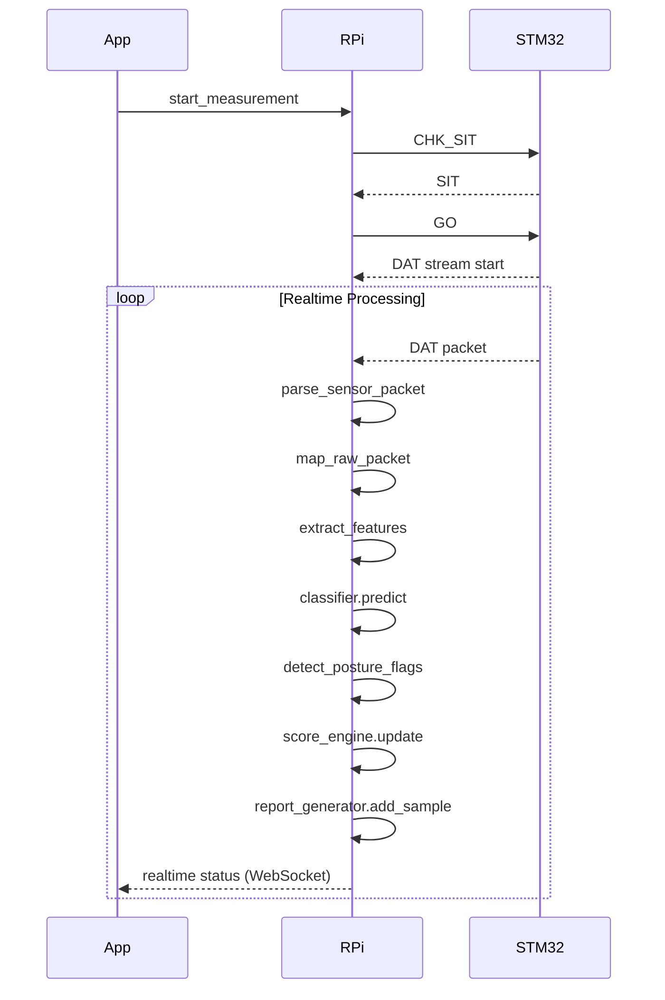
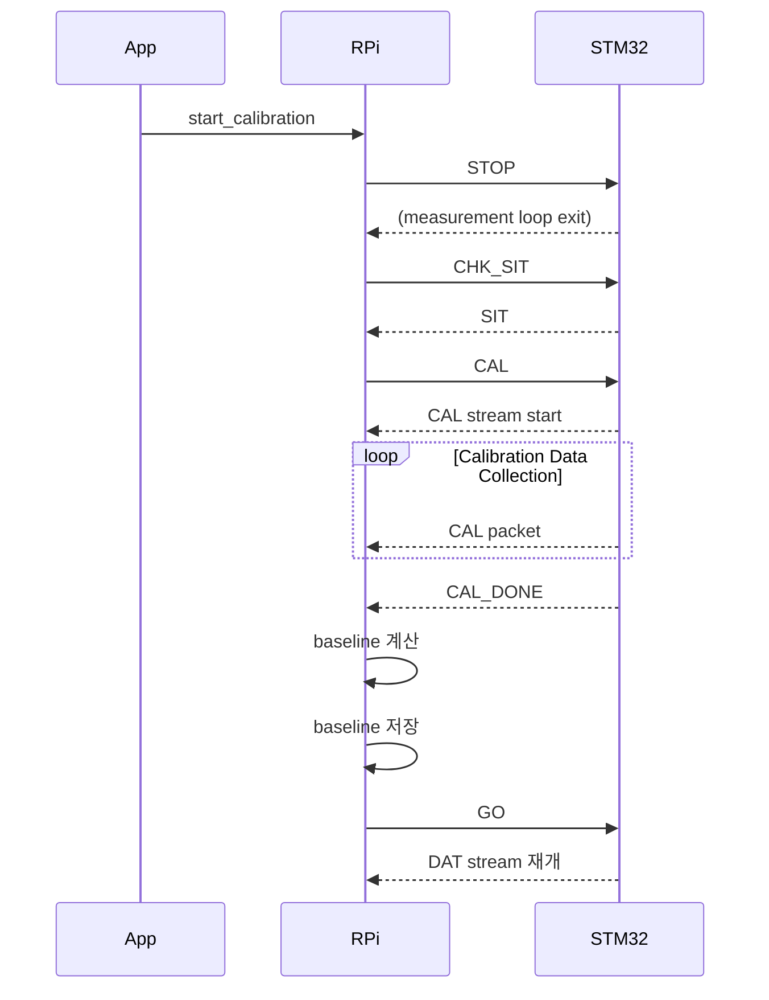
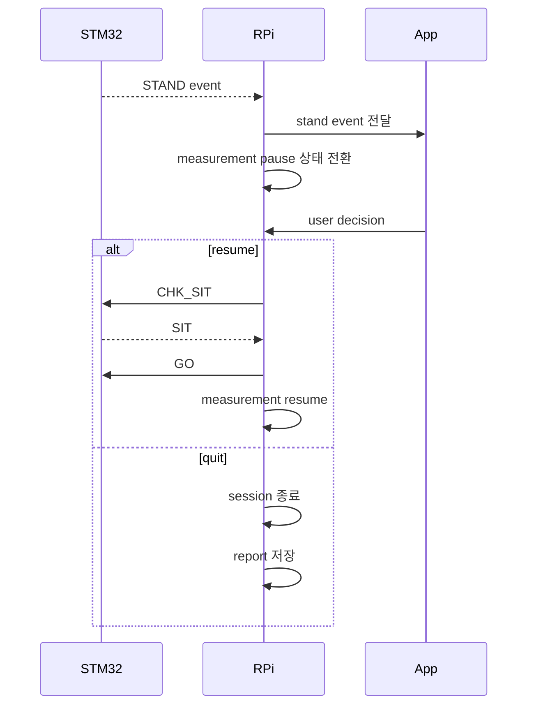
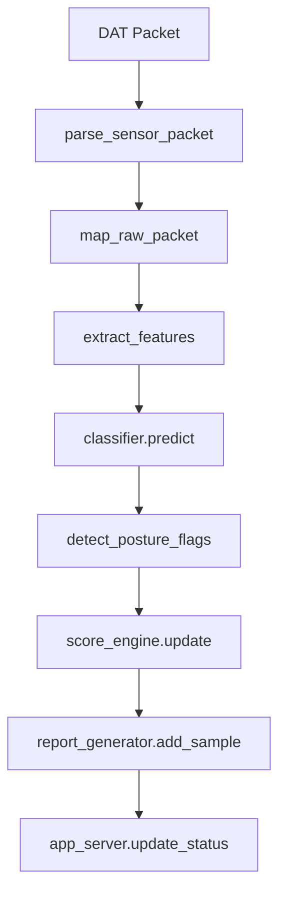

# Runtime Sequence

이 문서는 Edge Posture Monitoring System의 실제 런타임 동작 흐름을 정의한다.

시스템은 다음 3가지 주요 흐름으로 구성된다.

1. Measurement Flow (기본 측정 흐름)
2. Recalibration Flow (재캘리브레이션)
3. STAND Flow (착석 해제 이벤트 처리)

---

# 1. Measurement Flow

사용자가 측정을 시작했을 때의 기본 동작 흐름

---

# 2. Recalibration Flow

측정 중 재캘리브레이션 요청 시 동작 흐름

---

# 3. STAND Flow

사용자가 자리에서 일어났을 때 처리 흐름

---

# 4. Data Processing Pipeline(Runtime 내부 처리)

센서 데이터는 다음과 같은 파이프라인으로 처리된다.

---

# 5. 주요 설계 포인트

## 상태 기반 제어

시스템은 다음 상태를 기반으로 동작한다.

- WAIT_SIT
- CALIBRATING
- MEASURING
- PAUSED
- WAIT_RESTART_DECISION

## 통신 구조

- STM32 <-> RPi: UART(Binary + Control Message)
- RPi <-> App: HTTP / WebSocket

## 이벤트 기반 처리

- STAND 이벤트 -> 측정 중단 및 사용자 선택
- CAL_DONE 이벤트 -> 캘리브레이션 종료 신호

## 재캘리브레이션 특징

- 측정 중에도 수행 가능
- 기존 baseline을 새로운 baseline으로 교체
- 이후 측정은 새로운 기준으로 진행

---

# 6. 요약

이 시스템은 다음 특징을 가진다.

- 실시간 센서 데이터 처리 기반 자세 분석 시스템
- 상태 기반 제어 흐름
- 이벤트 기반 측정 제어(STAND / CAL_DONE)
- 재캘리브레이션 지원
- Edge 환경에서 독립적으로 동작 가능한 구조